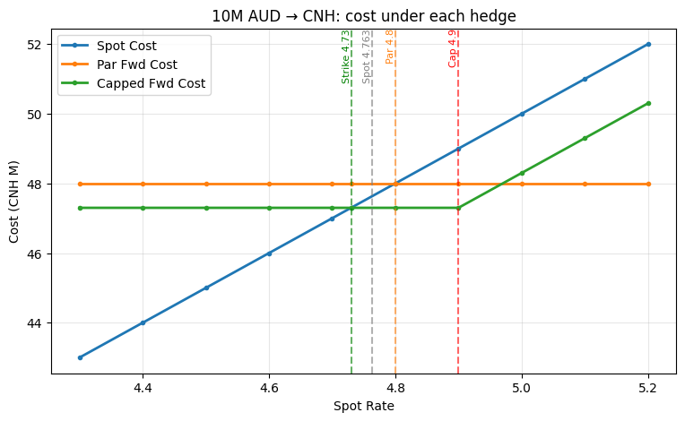
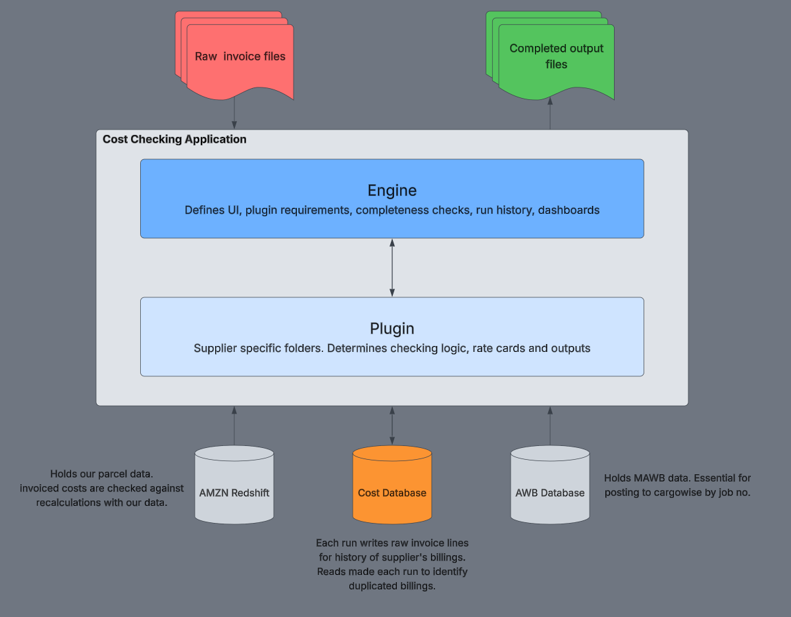

## Hi I'm Jesse

Data analyst working with financial and parcel freight data.

**Tools:** Python (Pandas, NumPy) · SQL · Excel · Power BI

### What I work on
- Automating high-volume invoice validation and reporting
- Cost, revenue and profit reporting and forecasting
- Designing and building applications to support cost analysts
- Database design and management

### Projects
**[fx-hedge-comparison](https://github.com/jesse-brewer/fx-hedge-comparison)**

Scenario model comparing par forward vs capped forward hedging strategies across a range of spot rates, showing break-even points and P&L under each. Built to support hedging decisions for AUD liabilities.

**[invoice-checking-application](https://github.com/jesse-brewer/invoice-checking-application)**

A standardised, locally hosted web app for checking freight invoices. One engine runs a plug-in module per supplier. Every invoice is re-priced against the rate card(s) and our own parcel data. Built to replace existing manual workflows for ~50 suppliers, handling ~250 invoices a week.
